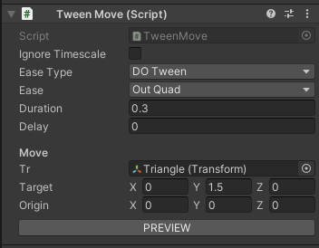
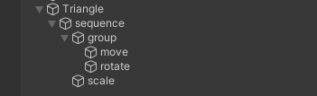
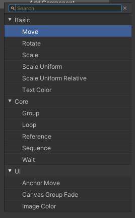

# Tween Creator

Easy and intuitive tweening tool for Unity, based on DOTween.

Several features:

#### Define tweens in components


#### Intuitive set up of groups and sequences 


#### Instant preview in editor mode (no side effects!)


#### Quick type switch from context menu


#### Create your own tweens with a few lines of code
```csharp
[TypeCategory(TweenCategory.Basic)]
 public class TweenScale : TweenCustomPlayable
 {
     [Header("Scale")]
     [SerializeField] private Transform tr;
     [SerializeField] private Vector3 target = Vector3.one;
     [SerializeField] private Vector3 origin = Vector3.one;
        
     private Vector3 m_savedState;

     public override void PlayForward() => PlaySingleTween(tr.DOScale(target, duration));
     public override void PlayBackwards() => PlaySingleTween(tr.DOScale(origin, duration));
     
     public override void SavePreviewState() => m_savedState = tr.localScale;
     public override void RestorePreviewState() => tr.localScale = m_savedState;
        
     public override void Rewind()
     {
         base.Rewind();
            
         tr.localScale = origin;
     }
 }
```