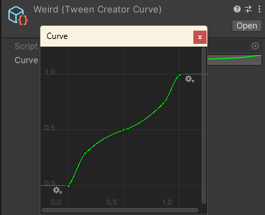

# Tween Creator

[](https://openupm.com/packages/com.thejoun.tween-creator/)

## Installation

See "Installation" on [OpenUPM](https://openupm.com/packages/com.thejoun.tween-creator).
Add these scopes:
- `com.thejoun`
- `com.solidalloy`
- `org.nuget`

## Features

#### Tweens defined in components


#### Intuitive composition of groups and sequences in hierarchy


#### Instant preview in editor mode (no side effects!)


#### Quick type switch from context menu


#### Your own custom tweens in a few lines of code
```csharp
[TypeCategory(TweenCategory.Basic)]
public class TweenScale : TweenCustomPlayable
{
    [Header("Scale")]
    [SerializeField] private Transform tr;
    [SerializeField] private Vector3 target = Vector3.one;
    [SerializeField] private Vector3 origin = Vector3.one;
        
    private Vector3 m_savedState;

    public override void PlayForward() => PlaySingleTween(tr.DOScale(target, duration));
    public override void PlayBackwards() => PlaySingleTween(tr.DOScale(origin, duration));
     
    public override void SavePreviewState() => m_savedState = tr.localScale;
    public override void RestorePreviewState() => tr.localScale = m_savedState;
        
    public override void Rewind()
    {
        base.Rewind();
            
        tr.localScale = origin;
    }
}
```

#### Custom eases as animation curves



### Dependencies

- https://github.com/thejoun/type-switcher